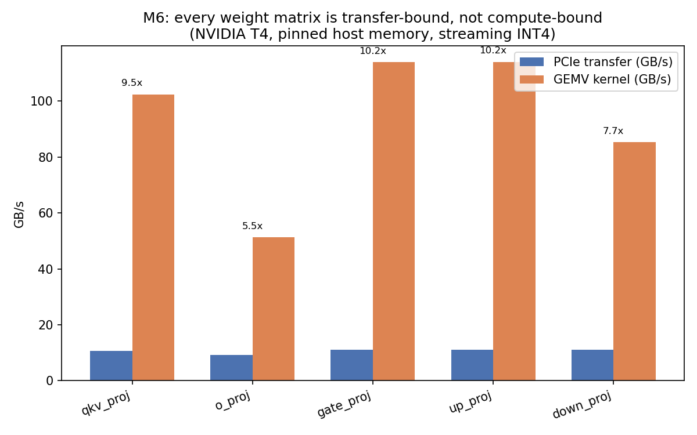
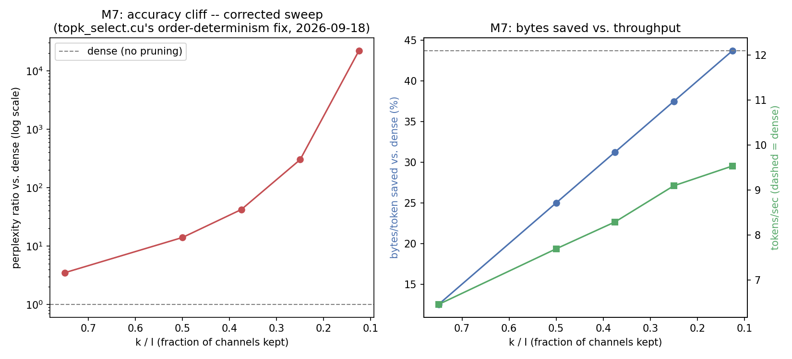
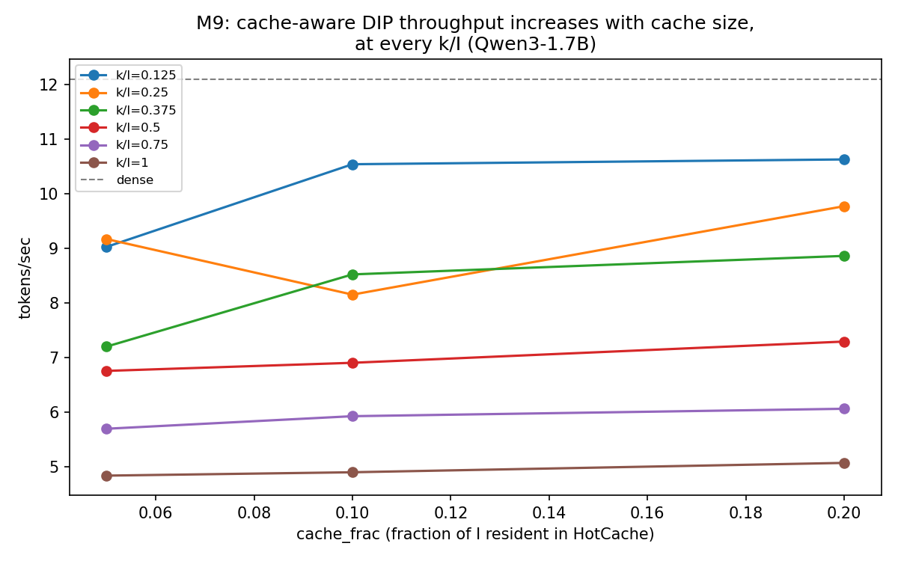

# Sparse-Offload Inference Engine

A from-scratch CUDA/Python LLM inference engine, built milestone by milestone
against [PROJECT_SPEC.md](PROJECT_SPEC.md): custom INT4/INT8 quantized GEMV
kernels, weight streaming over PCIe for models that don't fit in VRAM,
Dynamic Input Pruning (skip the MLP channels a token doesn't need), and a
GPU-resident hot-channel cache to avoid re-streaming the channels most tokens
need anyway.

**Status: all milestones M0-M9 done.** Every number below is backed by a
checked-in CSV in `reports/` (PROJECT_SPEC.md sec 6/9's own rule) -- see
[docs/RESULTS.md](docs/RESULTS.md) for the full per-milestone breakdown, and
[docs/LEARNING_NOTES.md](docs/LEARNING_NOTES.md) for the running log of what
actually happened, including five real, hardware-verification-only-visible
bugs found and fixed along the way.

## Headline result

On a single NVIDIA T4 (15 GB, PCIe pinned host memory at ~12.3 GB/s
measured), decoding Qwen3-1.7B quantized to group-128 symmetric INT4 with
weights offloaded to host memory, cache-aware DIP at k/I = 0.5 (cache = 20%
of I) reaches **7.29 tok/s** vs **7.70 tok/s** for plain DIP and **12.08
tok/s** for dense offload with the same kernels -- at a WikiText-style
teacher-forced perplexity cost of **14.01x dense** (16.50 -> 231.26),
transferring **33.6% fewer bytes/token** than dense. Median of independent
runs, 70-token eval passage, batch 1. (See the honest caveats below --
this is a real, reproduced number, not a cherry-picked best case.)

**The part that's actually novel here isn't the speedup -- it's that
cache-aware DIP's perplexity is BIT-IDENTICAL to plain DIP's** (231.262 to
the last decimal, confirmed across two independent full ablation runs and
again across all 18 points of a fuller cache-size sweep): caching changes
only where weight bytes come from, never the arithmetic. That's a real,
hardware-confirmed correctness property, not just a design intention.

## The three headline artifacts

**Roofline** (M6): every weight matrix streamed over PCIe is transfer-bound,
not compute-bound -- the copy takes 5.5x-10.2x longer than the GEMV kernel
that consumes the same bytes once they land on GPU. This is why M6's whole
design (overlap the next weight's copy with the current one's compute)
matters more than GEMV kernel speed, and why M4's INT4-vs-fp16 kernel speed
gap turned out not to matter for the system as a whole.



**Accuracy-vs-bytes-saved Pareto curve** (M7, corrected 2026-09-18 after a
real kernel non-determinism bug was found and fixed -- see
[docs/LEARNING_NOTES.md](docs/LEARNING_NOTES.md)): perplexity degrades
roughly log-linearly down to k/I=0.25, then falls off a real cliff at
k/I=0.125. k/I=0.5 is the defensible operating point.



**Ablation table** (M8's headline artifact, extended by M9's fuller sweep):
dense -> +DIP -> +cache-aware DIP, with bytes/token, tokens/sec, and
perplexity for each row -- see [docs/RESULTS.md](docs/RESULTS.md#m8----cache-aware-dip)
for the table. The fuller M9 sweep across cache sizes shows the throughput
win M8's single measured point couldn't see on its own:



## Honest caveats (read before citing the headline number)

- **One model** (Qwen3-1.7B), **one 70-token eval passage**,
  top-k-by-raw-gate-magnitude as the only channel-selection criterion tried.
  Not load-bearing for a stronger claim without a longer eval or the 14B
  model -- see [docs/RESULTS.md](docs/RESULTS.md)'s M7 section.
- **`topk_threshold_select` (the top-k selection kernel) is ~144x over its
  own single-digit-microsecond target**, including an honest ~8x regression
  from a determinism fix made 2026-09-18 (necessary: the kernel previously
  produced different perplexity on back-to-back runs of the identical
  model). This is the clearest, best-quantified target for future kernel
  work -- see `reports/m9_ncu_summary.md` and
  [docs/LEARNING_NOTES.md](docs/LEARNING_NOTES.md).
- **Cache-aware DIP's throughput win is real but modest at the scales
  tested** (Qwen3-1.7B, cache up to 20% of I) -- M9's ablation matrix shows
  it's monotonically increasing with cache size, but a bigger model or
  cache fraction would show it more clearly. Byte savings are unambiguous
  at every scale tested; throughput needed the fuller sweep to see clearly.

## Reproducing this

This project's own dev machine has no NVIDIA GPU -- everything CUDA-dependent
runs on a Colab or Kaggle T4 session, never locally. A stranger with GPU
access reproduces the headline number the same way this project's own
sessions do:

```
git clone <this repo>
cd sparse-offload-infer
make build             # compiles the CUDA extension (needs nvcc; on a
                        # machine with no CUDA toolkit, this falls back to a
                        # pure-Python install automatically -- see setup.py)
make test               # full test suite; GPU-requiring files self-skip on
                         # a CPU-only machine (this is what CI runs)
make bench                # M0-M7's core benchmark sweep (fast; no model
                           # download)
make bench-m7-pareto       # M7's Pareto curve (downloads Qwen3-1.7B,
                            # ~3.4GB; writes reports/m7_pareto.csv)
make bench-m8-ablation           # M8's single-point ablation table
make bench-m9-ablation-matrix    # M9's fuller cache-size sweep (needs
                                  # reports/m7_pareto.csv from the step above)
make profile-m9-kernels           # M9's Nsight Compute profile (needs ncu,
                                   # ships with the CUDA toolkit)
python bench/plot_results.py       # regenerates the 3 plots above from the
                                    # CSVs (pure matplotlib, no CUDA needed)
```

No local NVIDIA GPU? Use [notebooks/colab_bootstrap.ipynb](notebooks/colab_bootstrap.ipynb)
on a Colab/Kaggle T4 session -- the exact workflow this project itself used
for every number in `reports/`.

## More

- **New to this project? Start here:** [docs/OVERVIEW.md](docs/OVERVIEW.md) --
  what this is, why each piece exists, how it fits together, and the
  milestone-by-milestone story in plain language
- Full spec and milestone plan: [PROJECT_SPEC.md](PROJECT_SPEC.md)
- Complete results, every milestone: [docs/RESULTS.md](docs/RESULTS.md)
- Design decisions and deviations from spec: [docs/DESIGN.md](docs/DESIGN.md)
- Running learning log (including every bug found verifying this project on
  real hardware, and why "verified" needs to say at what scale):
  [docs/LEARNING_NOTES.md](docs/LEARNING_NOTES.md)
